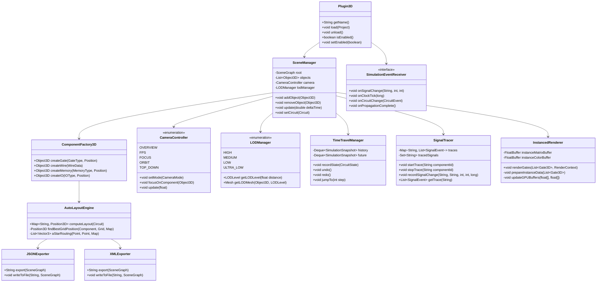
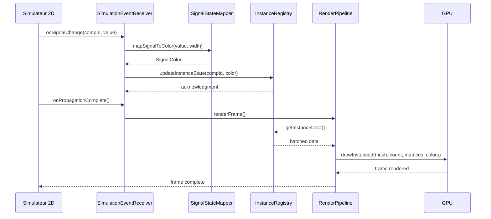
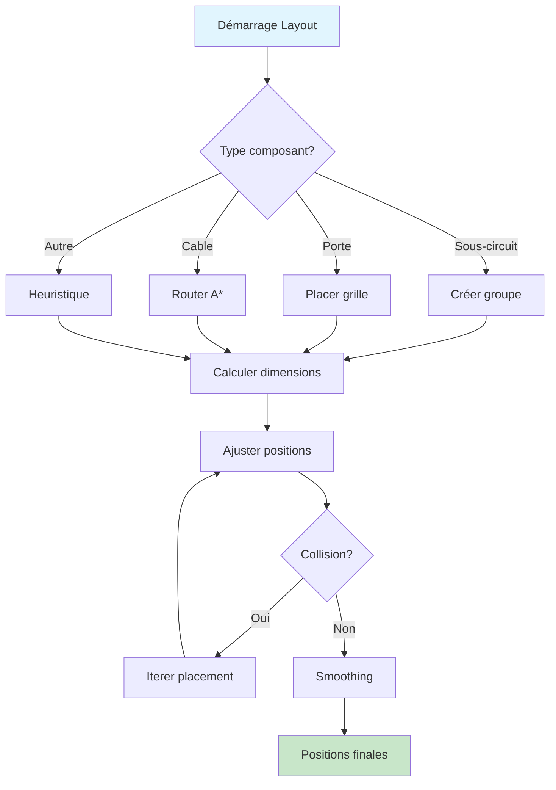
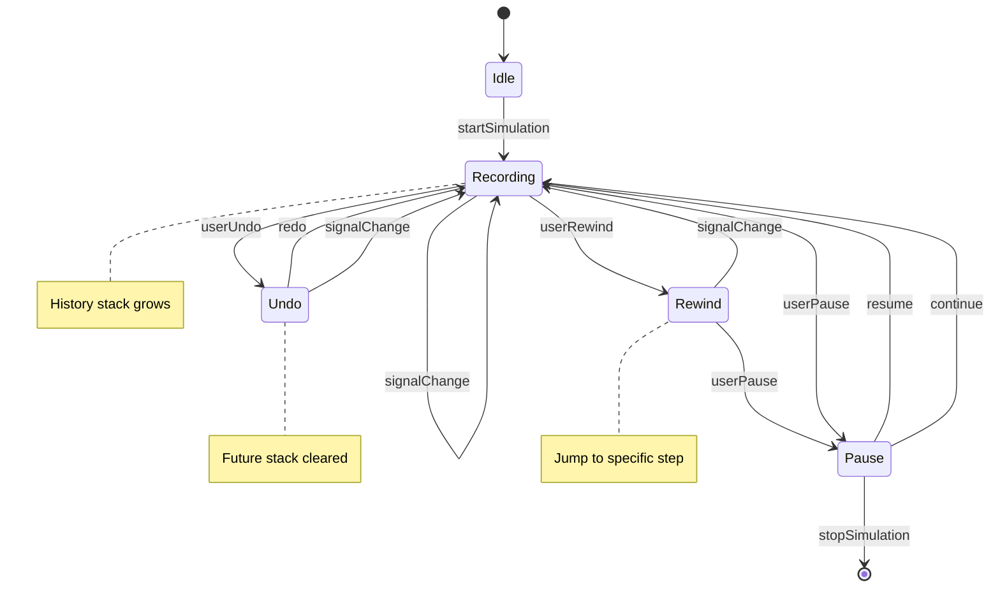
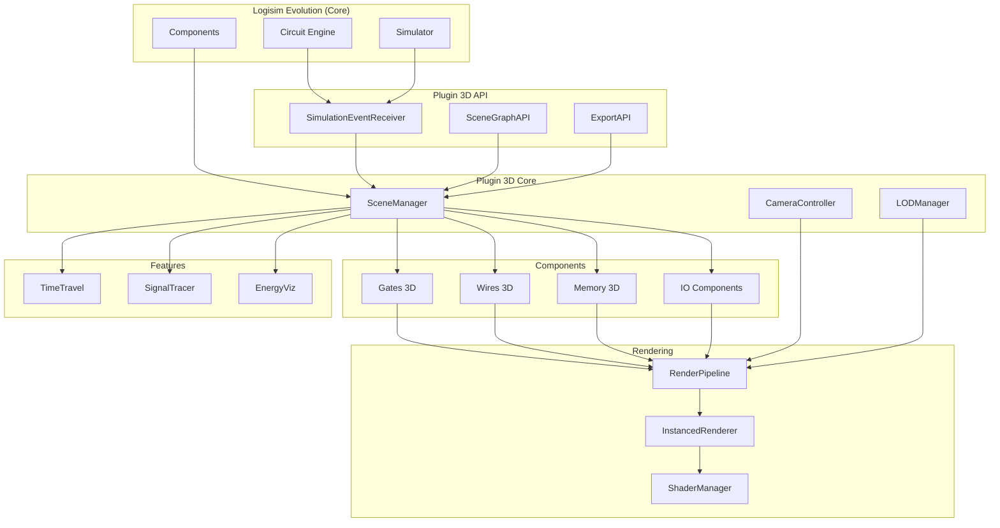

# UML et Diagrammes du Plugin 3D

## Diagramme de Classes Principal



---

## Diagramme de Séquence - Simulation vers Rendu



---

## Diagramme de Flux - Layout Automatique



---

## Diagramme d'Architecture - Pipeline GPU

```mermaid
flowchart LR
    subgraph CPU
        A[SceneManager] --> B[InstanceRegistry]
        B --> C[Batch Generator]
    end
    
    subgraph "Vertex Shader"
        D[Transform]
        D --> E[LOD Selection]
        E --> F[Normal Transform]
    end
    
    subgraph "Fragment Shader"
        G[Color Mapping]
        G --> H[Glow Effect]
        H --> I[Output]
    end
    
    C -->|"Instance Data"| D
    F -->|"Varyings"| G
    
    style CPU fill:#fff3e0
    style "Vertex Shader" fill:#e8f5e9
    style "Fragment Shader" fill:#fce4ec
```

---

## Diagramme de Statut - Time Travel



---

## Diagramme de Modules



---

## Exemples de Code Java

### Exemple 1: ComponentFactory3D

```java
package com.cburch.logisim.plugin3d.components;

import com.cburch.logisim.plugin3d.core.SceneManager;
import com.cburch.logisim.plugin3d.core.Object3D;
import com.cburch.logisim.std.gates.GateFactory;
import com.cburch.logisim.comp.Component;

public class ComponentFactory3D {
    
    private final SceneManager sceneManager;
    private final Map<String, Object3D> prototypeMeshes;
    
    public ComponentFactory3D(SceneManager sceneManager) {
        this.sceneManager = sceneManager;
        this.prototypeMeshes = new HashMap<>();
        loadPrototypes();
    }
    
    private void loadPrototypes() {
        // Charger les meshes prototypes pour chaque type
        prototypeMeshes.put("AND_2", loadMesh("gates/and_gate_2.obj"));
        prototypeMeshes.put("OR_2", loadMesh("gates/or_gate_2.obj"));
        prototypeMeshes.put("NOT", loadMesh("gates/not_gate.obj"));
        prototypeMeshes.put("XOR_2", loadMesh("gates/xor_gate_2.obj"));
        prototypeMeshes.put("NAND_2", loadMesh("gates/nand_gate_2.obj"));
    }
    
    public Object3D createGate(Component component, Position3D position) {
        String gateType = getGateTypeString(component);
        Object3D prototype = prototypeMeshes.get(gateType);
        
        if (prototype == null) {
            prototype = prototypeMeshes.get("AND_2"); // Default
        }
        
        Object3D instance = prototype.clone();
        instance.setPosition(position);
        instance.setComponentId(component.getId());
        
        // Configurer les ports
        configurePorts(instance, component);
        
        sceneManager.addObject(instance);
        return instance;
    }
    
    public Object3D createWire(Component wire, List<Position3D> path) {
        Wire3D wire3d = new Wire3D(wire.getId(), path);
        wire3d.setBitWidth(getBitWidth(wire));
        
        sceneManager.addObject(wire3d);
        return wire3d;
    }
    
    public Object3D createMemory(Component memory, Position3D position) {
        String memoryType = getMemoryTypeString(memory);
        Object3D prototype = loadMesh("memory/" + memoryType + ".obj");
        
        Object3D instance = prototype.clone();
        instance.setPosition(position);
        instance.setComponentId(memory.getId());
        
        // Ajouter afficheur hexadecimal si présent
        addHexDisplay(instance, memory);
        
        sceneManager.addObject(instance);
        return instance;
    }
    
    private String getGateTypeString(Component component) {
        // Extraire le type de porte depuis le composant Logisim
        Object factory = component.getFactory();
        if (factory instanceof GateFactory) {
            return ((GateFactory) factory).getName();
        }
        return "UNKNOWN";
    }
}
```

### Exemple 2: SignalStateMapper

```java
package com.cburch.logisim.plugin3d.simulation;

import com.jme3.math.ColorRGBA;

public class SignalStateMapper {
    
    // Couleurs par défaut
    private static final ColorRGBA COLOR_HIGH = new ColorRGBA(0, 1, 0, 1);    // Vert
    private static final ColorRGBA COLOR_LOW = new ColorRGBA(0.3f, 0.3f, 0.3f, 1);  // Gris
    private static final ColorRGBA COLOR_FLOAT = new ColorRGBA(1, 0.5f, 0, 1);  // Orange
    private static final ColorRGBA COLOR_ERROR = new ColorRGBA(1, 0, 0, 1);   // Rouge
    private static final ColorRGBA COLOR_UNKNOWN = new ColorRGBA(0.5f, 0.5f, 0.5f, 1);  // Gris foncé
    
    // Intensité de glow
    private static final float GLOW_INTENSITY_HIGH = 1.0f;
    private static final float GLOW_INTENSITY_LOW = 0.0f;
    
    public static SignalColor mapSignalToColor(int value, int bitWidth) {
        if (bitWidth == 1) {
            // Signal 1-bit
            if (value == 0) {
                return new SignalColor(COLOR_LOW, GLOW_INTENSITY_LOW, false);
            } else if (value == 1) {
                return new SignalColor(COLOR_HIGH, GLOW_INTENSITY_HIGH, true);
            } else if (value == -1 || value == 2) { // Floating
                return new SignalColor(COLOR_FLOAT, 0.5f, true);
            }
        } else {
            // Signal multi-bit: coder couleur par valeur
            float intensity = (float) value / ((1 << bitWidth) - 1);
            ColorRGBA color = new ColorRGBA(intensity, 1 - intensity, 0, 1);
            return new SignalColor(color, intensity, intensity > 0.5f);
        }
        
        return new SignalColor(COLOR_UNKNOWN, 0, false);
    }
    
    public static class SignalColor {
        public final ColorRGBA color;
        public final float glowIntensity;
        public final boolean animated;
        
        public SignalColor(ColorRGBA color, float glow, boolean animated) {
            this.color = color;
            this.glowIntensity = glow;
            this.animated = animated;
        }
    }
}
```

### Exemple 3: InstancedRenderer

```java
package com.cburch.logisim.plugin3d.rendering;

import com.jme3.scene.Mesh;
import com.jme3.scene.VertexBuffer;
import com.jme3.material.Material;
import com.jme3.renderer.RenderManager;
import com.jme3.renderer.pipeline.RenderPipeline;

public class InstancedRenderer {
    
    private static final int MAX_INSTANCES = 1024;
    private static final int MATRIX_SIZE = 16;
    private static final int COLOR_SIZE = 4;
    
    private Mesh instanceMesh;
    private FloatBuffer matrixBuffer;
    private FloatBuffer colorBuffer;
    private IntBuffer idBuffer;
    
    private Material instancedMaterial;
    
    public InstancedRenderer() {
        initBuffers();
        initMaterial();
    }
    
    private void initBuffers() {
        matrixBuffer = BufferUtils.createFloatBuffer(MAX_INSTANCES * MATRIX_SIZE);
        colorBuffer = BufferUtils.createFloatBuffer(MAX_INSTANCES * COLOR_SIZE);
        idBuffer = BufferUtils.createIntBuffer(MAX_INSTANCES);
    }
    
    private void initMaterial() {
        instancedMaterial = new Material("Shader/Instanced.j3md");
        instancedMaterial.setInt("maxInstances", MAX_INSTANCES);
        
        // Activer instancing
        instancedMaterial.getAdditionalRenderState()
            .setInstanced(true);
    }
    
    public void renderGates(List<Gate3D> gates, RenderContext context) {
        // Grouper par type de porte
        Map<GateType, List<Gate3D>> grouped = gates.stream()
            .collect(Collectors.groupingBy(Gate3D::getType));
        
        for (Map.Entry<GateType, List<Gate3D>> entry : grouped.entrySet()) {
            GateType type = entry.getKey();
            List<Gate3D> instances = entry.getValue();
            
            // Préparer les données d'instance
            int count = Math.min(instances.size(), MAX_INSTANCES);
            prepareInstanceData(instances.subList(0, count));
            
            // Rendu instanced
            renderInstanced(type.getMesh(), count, context);
        }
    }
    
    private void prepareInstanceData(List<Gate3D> gates) {
        matrixBuffer.rewind();
        colorBuffer.rewind();
        idBuffer.rewind();
        
        for (int i = 0; i < gates.size(); i++) {
            Gate3D gate = gates.get(i);
            
            // Matrice de transformation
            Matrix4f transform = gate.getWorldTransform();
            float[] matrix = new float[MATRIX_SIZE];
            transform.get(matrix);
            matrixBuffer.put(matrix);
            
            // Couleur selon état
            SignalColor signalColor = gate.getSignalColor();
            colorBuffer.put(signalColor.color.r);
            colorBuffer.put(signalColor.color.g);
            colorBuffer.put(signalColor.color.b);
            colorBuffer.put(signalColor.color.a);
            
            // ID composant
            idBuffer.put(gate.getComponentId());
        }
        
        matrixBuffer.flip();
        colorBuffer.flip();
        idBuffer.flip();
    }
    
    private void renderInstanced(Mesh baseMesh, int count, RenderContext context) {
        // Configurer les buffers d'instance
        baseMesh.setBuffer(VertexBuffer.Type.InstanceMatrix, MATRIX_SIZE, matrixBuffer);
        baseMesh.setBuffer(VertexBuffer.Type.Custom, COLOR_SIZE, colorBuffer);
        baseMesh.setBuffer(VertexBuffer.Type.Custom, 1, idBuffer);
        
        // Rendu
        RenderManager rm = context.getRenderManager();
        rm.renderMesh(baseMesh, instancedMaterial, count, context.getScene());
    }
}
```

### Exemple 4: TimeTravelManager

```java
package com.cburch.logisim.plugin3d.simulation;

import java.util.Deque;
import java.util.ArrayDeque;
import java.util.Map;

public class TimeTravelManager {
    
    private static final int MAX_HISTORY = 10000;
    
    private Deque<SimulationSnapshot> history = new ArrayDeque<>();
    private Deque<SimulationSnapshot> future = new ArrayDeque<>();
    
    private int currentStep = 0;
    private boolean isRecording = true;
    
    public void recordState(CircuitState state) {
        if (!isRecording) return;
        
        SimulationSnapshot snapshot = new SimulationSnapshot(
            state.getComponentStates(),
            state.getWireStates(),
            System.nanoTime(),
            currentStep++
        );
        
        history.push(snapshot);
        future.clear(); // Effacer le futur
        
        // Limiter la taille
        while (history.size() > MAX_HISTORY) {
            history.removeLast();
        }
    }
    
    public boolean undo() {
        if (history.size() <= 1) return false;
        
        SimulationSnapshot current = history.pop();
        future.push(current);
        
        SimulationSnapshot previous = history.peek();
        applyState(previous);
        currentStep = previous.getStep();
        
        return true;
    }
    
    public boolean redo() {
        if (future.isEmpty()) return false;
        
        SimulationSnapshot next = future.pop();
        history.push(next);
        
        applyState(next);
        currentStep = next.getStep();
        
        return true;
    }
    
    public void jumpTo(int step) {
        if (step < 0 || step >= history.size()) return;
        
        // Recréer l'historique jusqu'au pas souhaité
        while (history.size() > step + 1) {
            SimulationSnapshot s = history.pop();
            future.push(s);
        }
        
        applyState(history.peek());
        currentStep = step;
    }
    
    public int getCurrentStep() {
        return currentStep;
    }
    
    public int getHistorySize() {
        return history.size();
    }
    
    private void applyState(SimulationSnapshot snapshot) {
        // Appliquer l'état aux composants 3D
        for (var entry : snapshot.getComponentStates().entrySet()) {
            String componentId = entry.getKey();
            Object state = entry.getValue();
            updateComponentState(componentId, state);
        }
    }
    
    private void updateComponentState(String componentId, Object state) {
        // Mettre à jour l'objet 3D correspondant
    }
    
    public static class SimulationSnapshot {
        private final Map<String, Object> componentStates;
        private final Map<String, Object> wireStates;
        private final long timestamp;
        private final int step;
        
        public SimulationSnapshot(Map<String, Object> compStates, 
                                  Map<String, Object> wireStates,
                                  long timestamp, int step) {
            this.componentStates = Map.copyOf(compStates);
            this.wireStates = Map.copyOf(wireStates);
            this.timestamp = timestamp;
            this.step = step;
        }
        
        public Map<String, Object> getComponentStates() {
            return componentStates;
        }
        
        public Map<String, Object> getWireStates() {
            return wireStates;
        }
        
        public long getTimestamp() {
            return timestamp;
        }
        
        public int getStep() {
            return step;
        }
    }
}
```

---

## Exemple de Format JSON Complet

```json
{
  "schema_version": "1.0.0",
  "export_metadata": {
    "export_date": "2026-02-18T21:45:00Z",
    "source_software": "Logisim Evolution",
    "source_version": "3.8.0",
    "plugin_version": "1.0.0"
  },
  "circuit": {
    "id": "550e8400-e29b-41d4-a716-446655440000",
    "name": "cpu_alu",
    "description": "CPU ALU Unit",
    "spatial": {
      "bounding_box": {
        "min": {"x": 0, "y": 0, "z": 0},
        "max": {"x": 250, "y": 150, "z": 30}
      },
      "grid_size": 10,
      "unit_scale": 1.0
    },
    "components": [
      {
        "type": "AND_GATE",
        "subtype": "AND_2",
        "id": "comp_0x7f3a",
        "position": {"x": 20, "y": 30, "z": 0},
        "rotation": 0,
        "flip": false,
        "inputs": [
          {"id": "in_a", "local_index": 0, "position": {"x": 18, "y": 28, "z": 0}},
          {"id": "in_b", "local_index": 1, "position": {"x": 18, "y": 32, "z": 0}}
        ],
        "outputs": [
          {"id": "out", "local_index": 0, "position": {"x": 22, "y": 30, "z": 0}}
        ],
        "state": {
          "signal_value": 1,
          "bit_width": 1,
          "propagation_delay_ns": 0,
          "last_change_ns": 1234567890
        },
        "visualization": {
          "led_color": [0, 1, 0, 1],
          "glow_intensity": 1.0,
          "animated": true
        }
      },
      {
        "type": "FLIP_FLOP",
        "subtype": "D_FLIP_FLOP",
        "id": "comp_0x7f4b",
        "position": {"x": 80, "y": 50, "z": 0},
        "rotation": 90,
        "flip": false,
        "inputs": [
          {"id": "d", "position": {"x": 78, "y": 48, "z": 0}},
          {"id": "clk", "position": {"x": 78, "y": 52, "z": 0}}
        ],
        "outputs": [
          {"id": "q", "position": {"x": 82, "y": 48, "z": 0}},
          {"id": "not_q", "position": {"x": 82, "y": 52, "z": 0}}
        ],
        "state": {
          "signal_value": 0,
          "bit_width": 1,
          "clock_edge": "RISING"
        }
      },
      {
        "type": "RAM",
        "subtype": "RAM_2Kx8",
        "id": "comp_0x8f2a",
        "position": {"x": 150, "y": 80, "z": 0},
        "rotation": 0,
        "flip": false,
        "state": {
          "address_bits": 11,
          "data_bits": 8,
          "contents": [0, 255, 128, 64, 32, 16, 8, 4]
        },
        "visualization": {
          "hex_display": true,
          "led_color": [0, 1, 0.5, 1]
        }
      }
    ],
    "wires": [
      {
        "id": "wire_0x1a2b",
        "from": {"component": "comp_0x7f3a", "port": "out"},
        "to": {"component": "comp_0x7f4b", "port": "d"},
        "path": [
          {"x": 22, "y": 30, "z": 0},
          {"x": 40, "y": 30, "z": 0},
          {"x": 40, "y": 48, "z": 0},
          {"x": 78, "y": 48, "z": 0}
        ],
        "bit_width": 1,
        "state": {
          "signal_value": 1,
          "is_floating": false
        },
        "visualization": {
          "color": [0, 1, 0, 1],
          "thickness": 2.0,
          "glow": true
        }
      }
    ],
    "subcircuits": [
      {
        "id": "sub_0x9c3d",
        "circuit_ref": "adder_8bit",
        "position": {"x": 200, "y": 100, "z": 0},
        "rotation": 0,
        "instances": 1,
        "bounding_box": {
          "min": {"x": 200, "y": 100, "z": 0},
          "max": {"x": 230, "y": 120, "z": 10}
        }
      }
    ]
  },
  "rendering": {
    "default_camera": {
      "mode": "OVERVIEW",
      "position": {"x": 125, "y": 75, "z": 200},
      "target": {"x": 125, "y": 75, "z": 0},
      "fov": 60
    },
    "lighting": {
      "ambient": [0.2, 0.2, 0.2, 1],
      "directional": {
        "direction": [-0.5, -1, -0.5],
        "color": [1, 1, 1, 1],
        "intensity": 0.8
      }
    },
    "materials": {
      "pcb_body": {"color": [0.23, 0.23, 0.23, 1], "metalness": 0.3},
      "copper": {"color": [0.72, 0.45, 0.2, 1], "metalness": 0.8},
      "led_active": {"color": [0, 1, 0, 1], "emissive": [0, 1, 0, 1]},
      "led_inactive": {"color": [0.3, 0, 0, 1], "emissive": [0, 0, 0, 0]}
    }
  }
}
```
